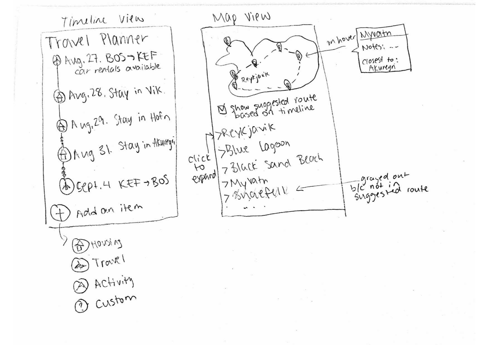
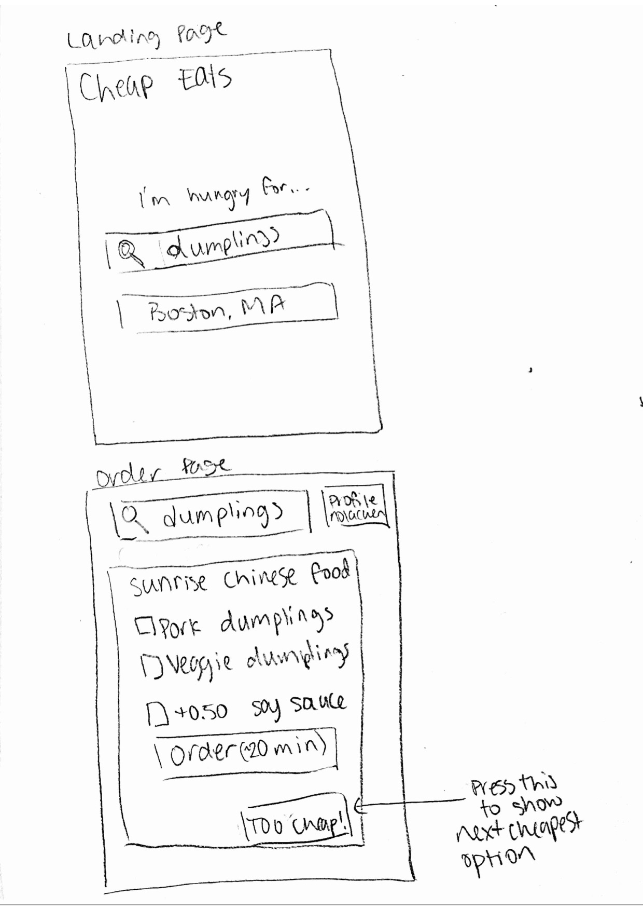
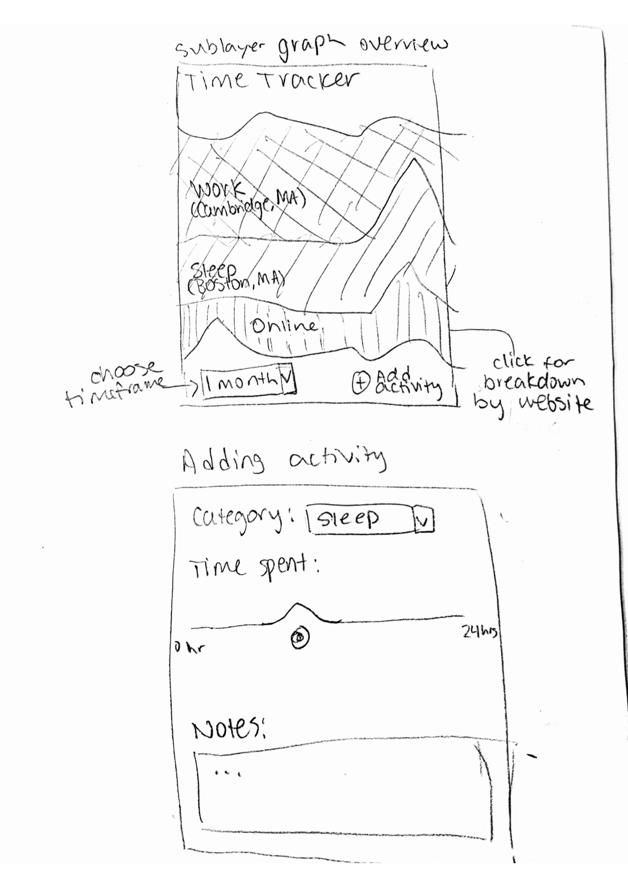

1. Travel Planner

Planning a trip is hard and time-consuming. Travel Planner helps you organize all of the important information that you need to have an enjoyable trip. You can map out places of interest, put them on a timeline, and create itineraries. The application is especially great for road trips, where timing and planning is even more important to get from one destination to the next. Travel Planner can also suggest efficient routes and attractions for your trip, given that you have limited time to explore a new place. For example, to plan a weeklong road trip around Iceland, you could visualize hundreds of interesting places, but know that you can't get to all of them -- then Travel Planner could help you decide which ones make the most sense to visit!

2. Cheap Eats

Sometimes, you get a craving for a very specific food but don't want to spend a lot of money to satisfy that craving. Cheap Eats will help you find the cheapest options for that one dish you can't stop thinking about! For example, if you have a 2 AM craving for soup dumplings, you can search for "soup dumplings" in your location and the app will display the cheapest dumplings using menu data from nearby restaurants. You then have the option to order those dumplings, or reject that restaurant for the next cheapest option.

3. Time Tracker

Time management can be tricky, especially for college students. With Time Tracker, you can visualize exactly where all of your time has been spent. The application utilizes location data to track where you go and how much you spend at places you frequent, as well as tracking how much time is spent on different websites you visit. You can also manually enter activities that you do. For example, you can track how much time you spend sleeping, eating, and on the computer (which can be further broken down by website). The goal of this application is to give the user a better understanding of how they spend their time.

